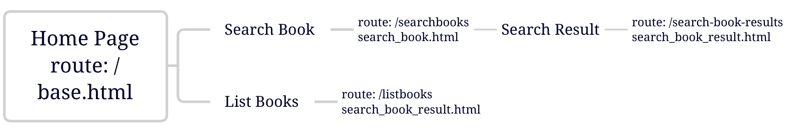
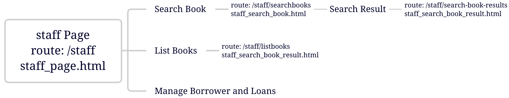
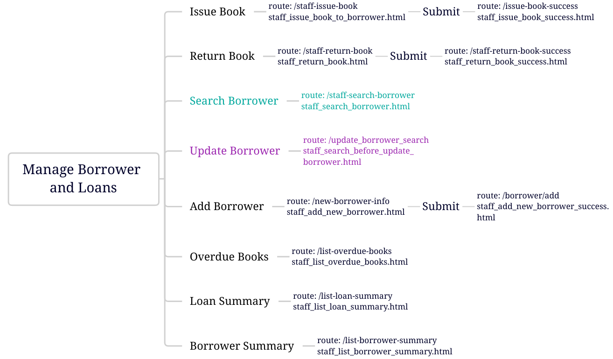
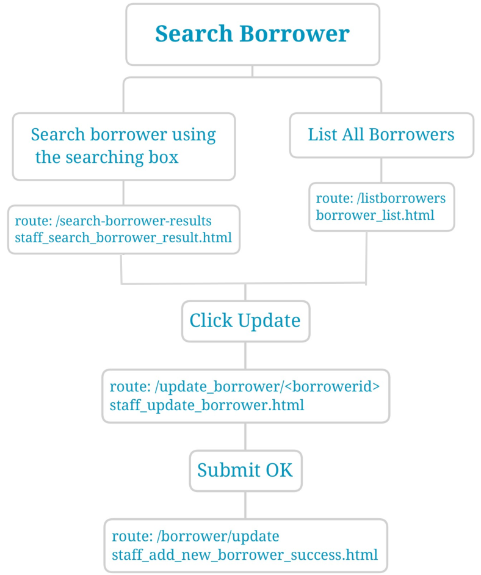
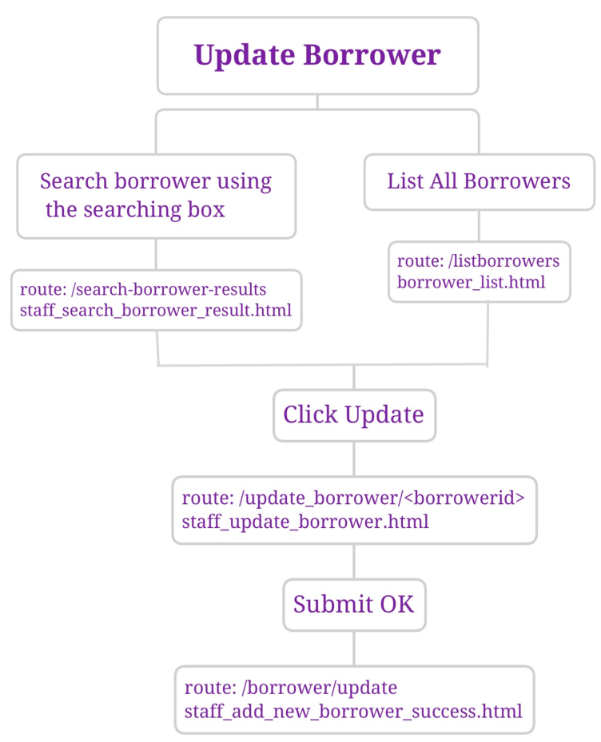
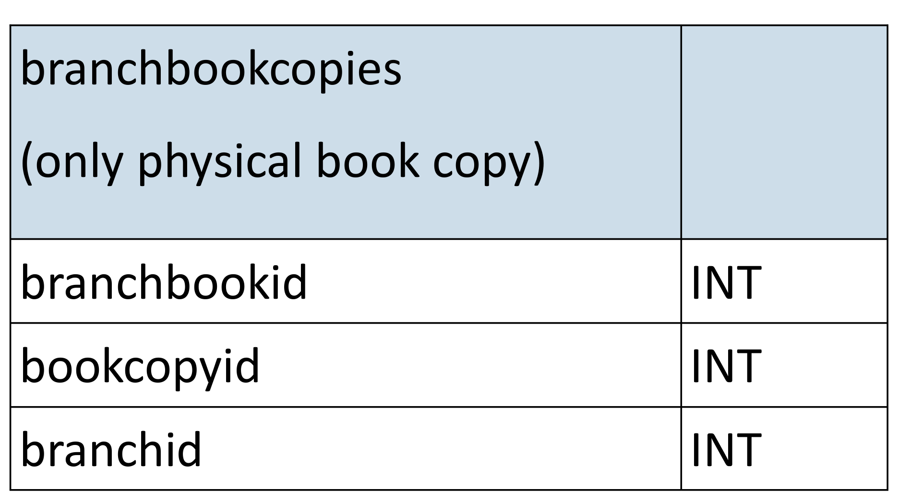

# Library Web Application - using Flask, Python, HTML, CSS, MySQL
(The very first web application development assignment at university, consists of design, implementation, testing, deployment to PythonAnywhere)

## Outline of the Web Application

The application consists of two main parts. One is a public access for borrowers to search for books' availability and list all books, the other one is for staff to manage borrowers and loans.

### Home Page And Public Search

The base.html renders Home Page which can be accessed by default route (/). There is a navigation bar on the header, and the main body in the centre area, which includes library information on the left area, a library picture on the right area. Contact and location displays on footer. Home page has two main functions: Search Book and List All Books. The route of Search Book function is /searchbooks, its template is search_book.html. The search page provides a select form for users to select search field which is book title, or book author, or both. After clicking search button, the template search_book_result.html will pass the book search result data to route /search-book-result. Search result data will display all the bookcopies including book title, book author, year of publication, status (available or on loan), if it's on loan, display the due date. 

List All Books can display the availability of all the bookcopies, pass the data from the template search_book_result.html to route /list-all-books.

User can go back to home page by clicking Waikirikiri Library anytime.

Home page outline:

</img>

### Staff Manage Page
Staff can access to the Manage Page through route /staff. There will be a dropdown menu on the right of the navigation bar. It will open a list of functions when click on it, the functions include Issue Book, Return Book, Search Borrower, Update Borrower, Add New Borrower, Overdue Books, Loan Summary and Borrower Summary. On staff page, user can still search books and list all books. 

Staff page outline:

</img>

Manage Borrower and Loans outline:

</img>

Issue Book and Return Book function both have a dropdown select form which also accept text input, so staff can search the information quickly. The template staff_issue_book_to_borrower.html and staff_return_book.html pass bookcopy and borrower data to route /staff-issue-book and staff-return-book.
After issuing book successfully, the loans table in the database will be inserted a new loan. After returning book successfully, the loans table in the database will be updated on the Returned column. The List All Loans function is provided for staff to check the updated data. The template current_loans.html will pass the latest loans to route /currentloans.

Search Borrower function is similar with the Search Book function, the template staff_search_borrower_result.html pass searched borrower details to route /search-boroower-result.
Apart from checking the borrower details, an Update function is provided on the last column of each borrower, staff can edit borrower from here directly. 

Search Borrower outline:

</img>

Update Borrower function needs staff to search borrower first, and then update the searched borrower, or staff can use List All Borrowers to list all the borrower and find the one to update.
After clicking Update, the staff_update_borrower will pass the current borrower detail to route /update_borrower/<&ltborrowerid>, staff can edit and submit changes, and then the borrowers table will be updated.

Update Borrower outline:

</img>

Add Borrower function displays an empty form for staff to input all the information of a new borrower, after finishing inputting the template staff_add_new_borrower.html passes the data to route /borrower/add,  and then the new borrower will be inserted to borrowers table.

Overdue Books function lists all the overdue books which have been on loan longer than 35 days. The template staff_list_overdue_books.html passes overdue bookcopies data to route /list-overdue-books.

Loan Summary function lists the loans data, including book title, book format and the number of times each book has been loaned on total. The template staff_list_loan_summary.html passes loans data to route /list-loan-summary.
 
Borrower Summary function lists the borrower information including borrower's full name, and the number of loans each borrower has had. The template staff_list_borrower_summary.html passes borrower data to route /list-borrower-summary.

## Design Decisions

The public page and staff page share the navigation bar on header.

Search Book result and List Books show the book details, but the book descriptions are too long, so the "title" attribute has been used to make it shorter, and user can see the whole detail description by hovering mouse on the description area.

This application uses POST method on many pages displays to get the user input, such as search book, search borrower.
POST method is also used on the issue book, return book, add borrower, and update borrower pages to get user input and then update the database.

Update Borrower and Add Borrower function have limited the length of input by using "maxlength" attribute to make sure that the database can be updated correctly.

Issue Book and Return Book, both use "datalist" to increase search efficiency, user can not only choose bookcopy and borrower but also can enter text or numbers to make a quick search. 

The public Search Book result displays a descriptive list for book details which can be user friendly.

## Discussion

In order to support multiple branches, a new table needs to be created, indicating that which branch each physical book is in.

A new table refers to the relationship of physical books and branches:

</img>

bookbranchid is the primary key of the table.
bookcopyid is the foreign key that refers to the bookcopyid in bookcopies table.
branchid identifies every branch.

With this new table, the web application could provide details of each branch, for example, the numbers of physical books each branch has, which branch a physical book is available in, loans detail of each branch.

The web application would make some design changes to support multiple branches. 

1.Adding a branch access for public book search, because users may want to see the availability of books in the nearest branch. 

2.Search book result will provide branch details of searched physical book.

3.List Books function will provide branch access to display all books of selected branch.

4.Issue and Return Book would let the staff choose which branch they would like to issue from or return to if this book is physical. 

5.Staff page would add branch access for staff to check each branch's database information, such as a summary of numbers of physical books each branch has, a loans summary of each branch, a borrowers summary that the number of loans they have had in each branch.
